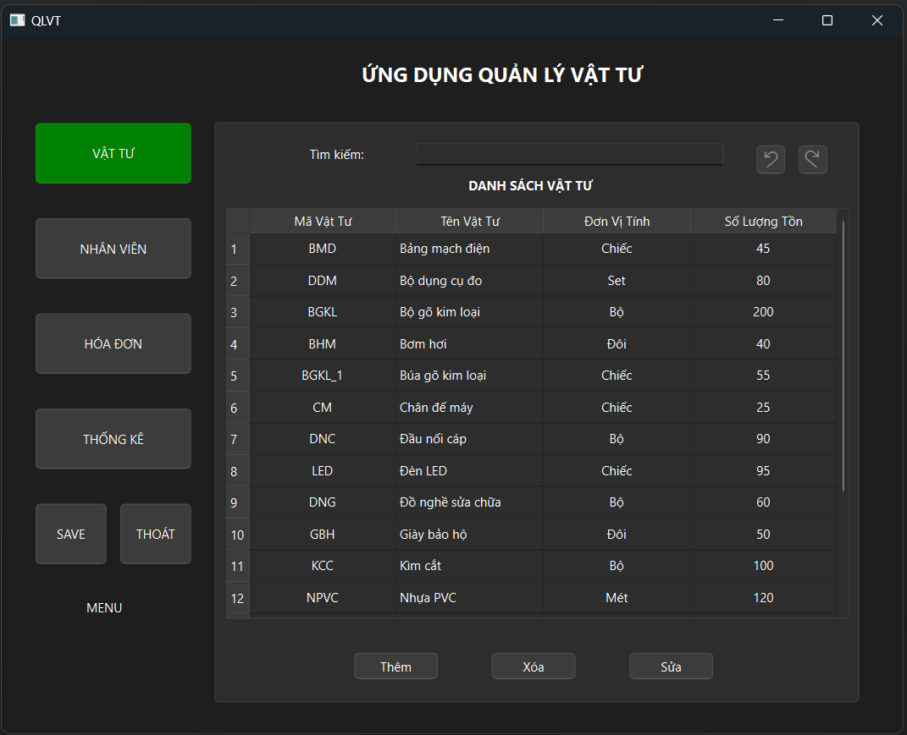

# Quản Lý Vật Tư - Đồ Án CTDL&GT

**Học viện Công Nghệ Bưu Chính Viễn Thông TP.HCM**

**Giảng viên hướng dẫn:** Lưu Nguyễn Kỳ Thư

**Tác giả:**
1. Nguyễn Hữu Dũng
2. Phạm Thanh Linh
3. Hà Hữu Thắng

## Giới thiệu

Hệ thống quản lý vật tư giúp theo dõi và quản lý thông tin vật tư, nhân viên và hóa đơn. Hệ thống cung cấp các chức năng chính như nhập xuất vật tư, quản lý nhân viên, lập và in hóa đơn, cũng như thống kê dữ liệu.



## Cấu trúc Dữ liệu

- **Danh sách Vật Tư** (`VatTu`): Cây nhị phân tìm kiếm với các trường `MAVT`, `TENVT`, `DVT`, `SoLuongTon`.
- **Danh sách Nhân Viên** (`NhanVien`): Danh sách tuyến tính với các trường `MANV`, `HO`, `TEN`, `PHAI`, `dshd` (danh sách hóa đơn của nhân viên).
- **Danh sách Hóa Đơn** (`HoaDon`): Danh sách liên kết đơn với các trường `SoHD`, `NgayLap`, `Loai`, `cthd` (danh sách chi tiết hóa đơn).
- **Danh sách Chi Tiết Hóa Đơn** (`CT_HoaDon`): Danh sách tuyến tính với các trường `MAVT`, `SoLuong`, `DonGia`, `%VAT`.

## Các Chức Năng Chính

1. **Nhập vật tư**: Thêm, xóa, hoặc hiệu chỉnh thông tin vật tư. Số lượng tồn chỉ nhập khi thêm mới.
2. **In danh sách vật tư tồn kho**: Liệt kê vật tư theo tên tăng dần.
3. **Nhập nhân viên**: Cập nhật thông tin nhân viên.
4. **In danh sách nhân viên**: Hiển thị nhân viên theo tên và họ.
5. **Lập hóa đơn**: Nhập số hóa đơn, ngày lập, loại ('N' cho nhập, 'X' cho xuất) và chi tiết vật tư. Cập nhật số lượng tồn kho tương ứng.
6. **In hóa đơn**: In hóa đơn theo số hóa đơn.
7. **Thống kê hóa đơn**: In hóa đơn lập trong khoảng thời gian cụ thể.
8. **In 10 vật tư doanh thu cao nhất**: Danh sách 10 vật tư có doanh thu cao nhất trong khoảng thời gian.

## Hướng dẫn Cài đặt và Sử dụng

1. **Clone Repository**:
   ```bash
   git clone https://github.com/Bravery23/CTDL_PTIT-HCM.git
2. **Run file QLVT.exe**

## Liên hệ

Nếu bạn có bất kỳ câu hỏi hoặc cần hỗ trợ thêm, vui lòng liên hệ qua các phương thức sau:

- Email: nhd230402@gmail.com
- Số điện thoại: 0348 256 786
